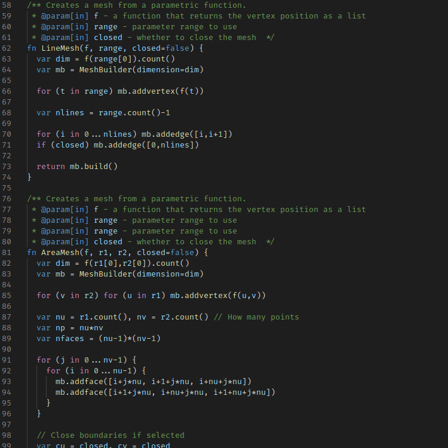

# morpho-vscode

Support for the [Morpho](https://github.com/Morpho-lang/morpho) language in VSCode.

## Features

* This extension enables basic syntax highlighting for Morpho code.



## Manual Installation

This extension can be manually installed by first generating a `*.vsix` file.
Note that you must have `node` and `npm` installed.

```shell
>> npm install
>> npx vsce package
```

This will create a file called `morpho-x.y.z.vsix`, with `x.y.z` the extension
version. This can then be installed:

```shell
>> code --install-extension morpho-x.y.z.vsix
```
